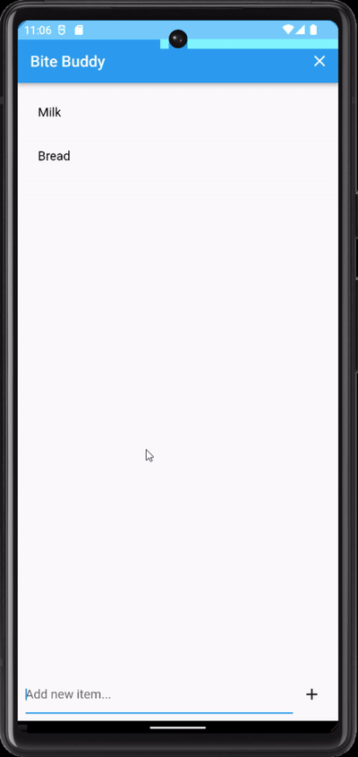

# BiteBuddy
BiteBuddy is a shopping list app focused on helping families coordinate their shopping lists. Our secondary goal is to encourage healthier and more sustainable consumption habits by offering alternative options with a lower carbon footprint.



## Goal
The primary goal of BiteBuddy is to provide a seamless and user-friendly experience for families to manage and coordinate their shopping lists. Additionally, we aim to encourage better consumption habits by offering healthier and lower carbon footprint alternatives by implementing an LLM-based recommendation system to recommend healthier products with a lower carbon footprint for the user (Currently unimplemented).  

A personal goal of this project is to learn Bloc for state management and to implement best practices and clean architecture as much as reasonably possible.  

## Features
* Real-time synchronization of a shopping list by implementing streams
* Suggest healthier and lower carbon footprint alternatives to the user (unimplemented)
* Easily add, reorder and remove items from the list

## Architecture
BiteBuddy is built using Flutter and follows clean architecture principles to ensure maintainability and scalability. The app uses Firebase Realtime Database for data storage and Bloc for state management.

## Guides  
### Getting Started
1. Clone the repository
2. Run 'futter pub get' to fetch dependencies
3. Run the app using 'flutter run'

### Testing
BiteBuddy follows a test-driven development (TDD) approach. To ensure code quality and stability, we encourage thorough unit, widget, and integration testing.  

#### Generating Mocks
To generate mock classes, run the following command:

```
flutter pub run build_runner build
```
#### Running Tests
To run tests (unit, widget), use the following command:
```
flutter test
```
To run integration tests, use the following command:
```
flutter test integration_test/app_test.dart
```

## Known Limitations
- Offline usage not supported
- Authentication has not been implemented
- Limited widget testing
- Only one integration test available
- Unit testing could be more thorough
- LLM based recommendation system is not implemented yet

### Weak spots/areas to look for errors
- Handling of streams in Bloc & testing them
- Enhancing test coverage
- Adding more features to improve user experience
- Not tested on iOS but the project should not contain anything platform specific